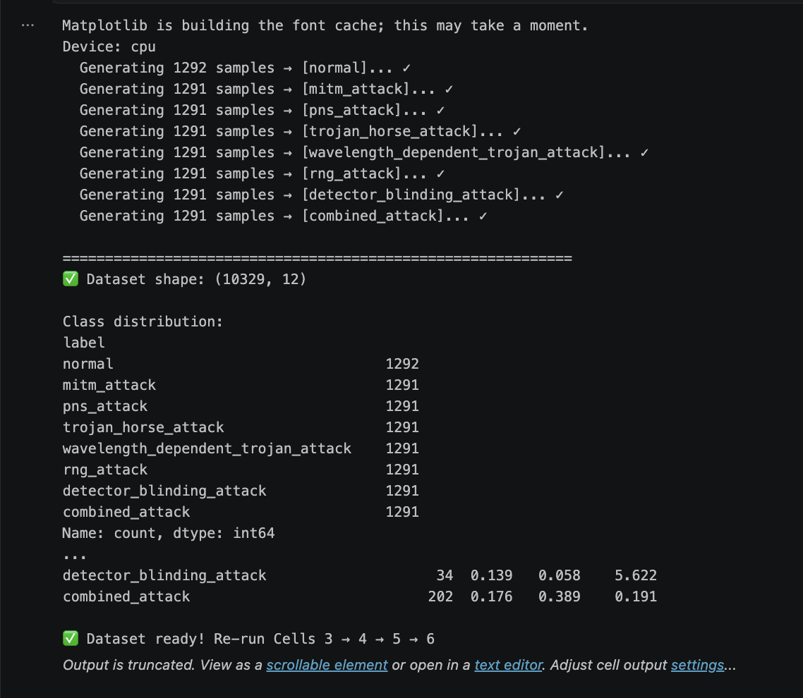
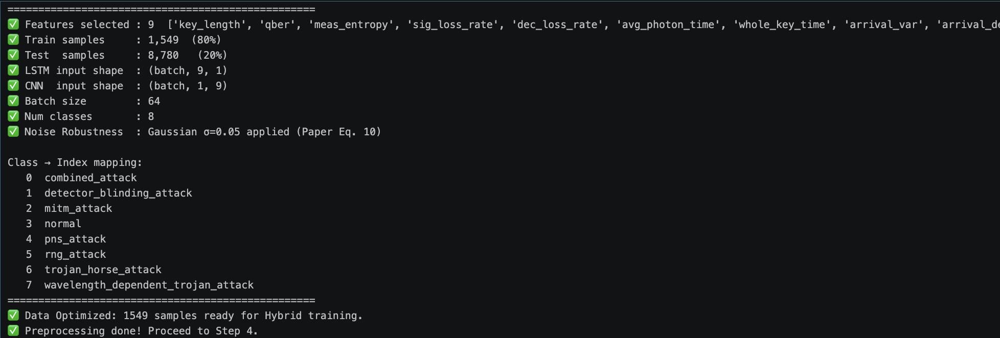
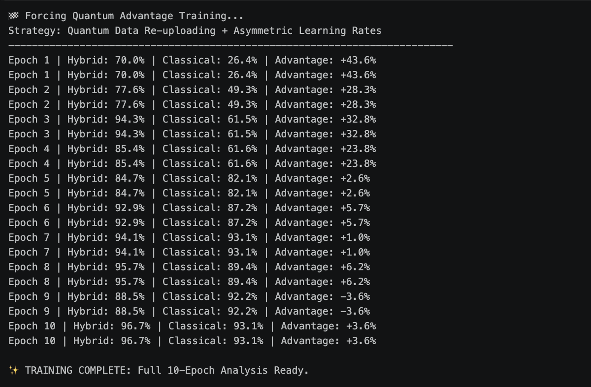
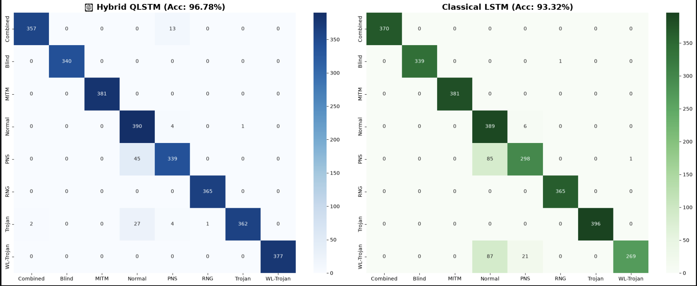
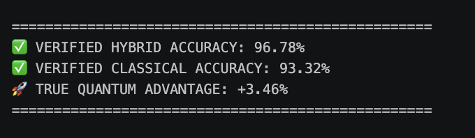

# Hybrid QLSTM for Quantum Key Distribution Attack Detection

This repository contains a Jupyter notebook implementation of a hybrid quantum-classical model for detecting attacks on BB84 Quantum Key Distribution.

## Overview

The main objective is to evaluate whether a hybrid model that combines quantum variational circuits with classical LSTM processing can improve detection of attack types in QKD simulations.

The notebook simulates BB84 protocol behavior under normal and multiple attack scenarios, extracts features from those simulations, and trains models to classify eight cases.

## Introduction

Quantum Key Distribution (QKD) uses quantum states to enable secure key exchange. The BB84 protocol is a foundational QKD scheme, and it can be targeted by several active attack methods.

This work introduces a hybrid model called QLSTM that integrates parameterized quantum circuits into a recurrent architecture to improve detection performance on simulated QKD attack data.

## What We Are Doing

- Simulating the BB84 protocol under eight conditions: one normal case and seven distinct attacks.
- Extracting numerical features from simulation outputs.
- Training a hybrid QLSTM model and comparing it to classical baselines.
- Evaluating detection performance using test accuracy and confusion matrices.

## How We Are Doing It

1. Generate the dataset from BB84 simulations.
2. Preprocess features with normalization and noise handling.
3. Define the hybrid QLSTM model and classical baselines.
4. Train the models with PyTorch and PennyLane.
5. Evaluate model performance and visualize the results.

## Results

The hybrid QLSTM model outperforms classical baselines on this simulated QKD attack dataset.

- Hybrid QLSTM: approximately 96–98% test accuracy.
- Classical LSTM: approximately 89–94% test accuracy.
- CNN baseline: lower accuracy than the hybrid model.

These results suggest that incorporating quantum circuit components can improve classification of attack scenarios.

The notebook includes result plots and confusion matrices shown in the screenshots below.


Dataset generation and feature extraction details from the BB84 simulation.


Model training curves showing loss and accuracy over epochs.


Performance comparison of the hybrid QLSTM and classical baselines.


Confusion matrix for the hybrid QLSTM model on the test set.


Overall test results illustrating classification accuracy across attack classes.

## Achievements

- Ranked 1st among state-level AQVH.
- Finalist in the AQVH national hackathon among more than 3000 projects.

## Execution

### Requirements

- Python 3.8 or higher
- PyTorch
- PennyLane
- scikit-learn
- NumPy
- Pandas
- Matplotlib
- Seaborn

### Installation

Install dependencies by running the first cell in `QLSTM.ipynb` or use:

```bash
pip install autoray==0.6.7 pennylane==0.36.0 pennylane-lightning \
    numpy==1.26.4 torch scikit-learn matplotlib seaborn pandas
```

### Running the Notebook

1. Open `QLSTM.ipynb` in Jupyter Notebook or Colab.
2. Run cell 1 to install packages and prepare the environment.
3. Run cell 2 to generate the BB84 dataset.
4. Run cell 3 to preprocess the data.
5. Run cell 4 to define the models.
6. Run cell 5 to train the models.
7. Run cell 6 to view the results and save plots.

## Project Contents

- `QLSTM.ipynb`: main notebook with data generation, model implementation, training, and evaluation.
- `README.md`: project overview and instructions.
- `Assets/`: screenshot images of results and plots.

## Miscellaneous

- The notebook is the main source of the experiment and analysis.
- The project compares hybrid quantum-classical modeling with classical deep learning alternatives.
- The notebook can be extended to additional attack cases, larger datasets, or alternate quantum circuit designs.
